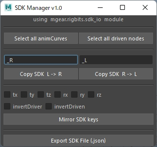

# SDK_Manager
GUI to make mgear.rigbits.sdk_io easier to use. mGear must be installed.  
[mgear.rigbits.sdk_io](https://github.com/mgear-dev/mgear4/blob/master/release/scripts/mgear/rigbits/sdk_io.py)

Tested with :
* Maya 2018 / 2020
* mGear 3.7.11 / 4.0.7

***
  
* **copySDKsToNode()**, **mirrorSDKkeys()** and **exportSDKs()** can be used in GUI.  
* Please use Maya standard feature (Key > Set Driven Key > Set...) for initial driven key creation.
